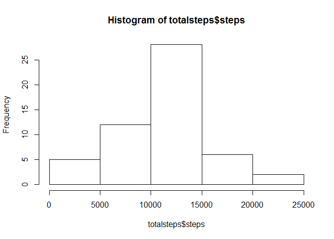
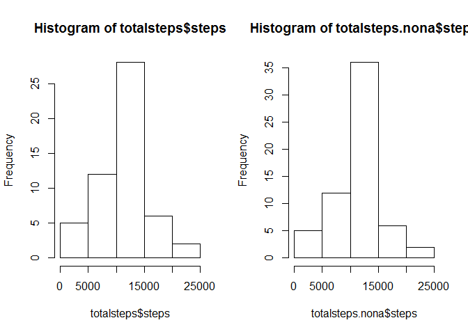
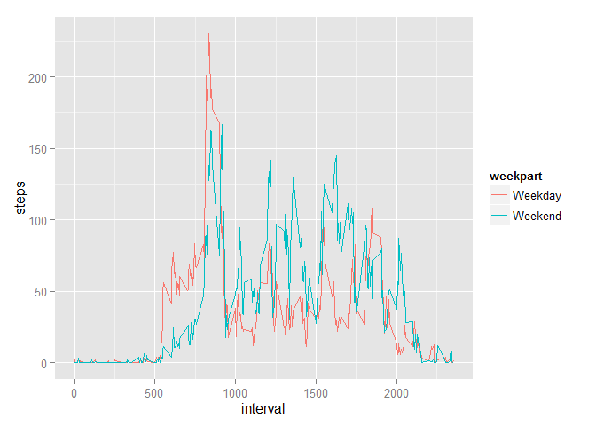

# Reproducible Research: Peer Assessment 1


## Loading and preprocessing the data
**Not Shown: **Before I began, I unziped the activity.zip file into ./data/activity.csv  
Next, read the data in  
And, convert the date strings to date types  

### Code for reading in the dataset and/or processing the data

```r
thedata <- read.csv("./data/activity.csv", na.strings="NA")
thedata$date <- as.Date(as.character(thedata$date))
str(thedata)
```

```
## 'data.frame':	17568 obs. of  3 variables:
##  $ steps   : int  NA NA NA NA NA NA NA NA NA NA ...
##  $ date    : Date, format: "2012-10-01" "2012-10-01" ...
##  $ interval: int  0 5 10 15 20 25 30 35 40 45 ...
```


## What is mean total number of steps taken per day?
Sum the steps by day  
Then, take a quick look  
And, the mean and median  


```r
totalsteps <- aggregate(steps ~ date, data=thedata, sum)
totalsteps 
```

```
##          date steps
## 1  2012-10-02   126
## 2  2012-10-03 11352
## 3  2012-10-04 12116
## 4  2012-10-05 13294
## 5  2012-10-06 15420
## 6  2012-10-07 11015
## 7  2012-10-09 12811
## 8  2012-10-10  9900
## 9  2012-10-11 10304
## 10 2012-10-12 17382
## 11 2012-10-13 12426
## 12 2012-10-14 15098
## 13 2012-10-15 10139
## 14 2012-10-16 15084
## 15 2012-10-17 13452
## 16 2012-10-18 10056
## 17 2012-10-19 11829
## 18 2012-10-20 10395
## 19 2012-10-21  8821
## 20 2012-10-22 13460
## 21 2012-10-23  8918
## 22 2012-10-24  8355
## 23 2012-10-25  2492
## 24 2012-10-26  6778
## 25 2012-10-27 10119
## 26 2012-10-28 11458
## 27 2012-10-29  5018
## 28 2012-10-30  9819
## 29 2012-10-31 15414
## 30 2012-11-02 10600
## 31 2012-11-03 10571
## 32 2012-11-05 10439
## 33 2012-11-06  8334
## 34 2012-11-07 12883
## 35 2012-11-08  3219
## 36 2012-11-11 12608
## 37 2012-11-12 10765
## 38 2012-11-13  7336
## 39 2012-11-15    41
## 40 2012-11-16  5441
## 41 2012-11-17 14339
## 42 2012-11-18 15110
## 43 2012-11-19  8841
## 44 2012-11-20  4472
## 45 2012-11-21 12787
## 46 2012-11-22 20427
## 47 2012-11-23 21194
## 48 2012-11-24 14478
## 49 2012-11-25 11834
## 50 2012-11-26 11162
## 51 2012-11-27 13646
## 52 2012-11-28 10183
## 53 2012-11-29  7047
```

### A histogram of the total number of steps taken each day

```r
hist(totalsteps$steps)
```

 

### Both the mean and median number of steps taken each day

```r
summary(totalsteps$steps)
```

```
##    Min. 1st Qu.  Median    Mean 3rd Qu.    Max. 
##      41    8841   10760   10770   13290   21190
```


## What is the average daily activity pattern?
Take the mean of steps by interval  
And see which interval has the highest average  
Then, plot them  


```r
averagesteps <- aggregate(steps ~ interval, data=thedata, FUN="mean")
averagesteps[averagesteps$steps==max(averagesteps$steps),] # get the entry at max
```

```
##     interval    steps
## 104      835 206.1698
```

### A time series plot of the average number of steps taken (averaged across all days) versus the 5-minute intervals

```r
plot(averagesteps, type="l")
```

 

###  The 5-minute interval that, on average, contains the maximum number of steps
Interval number 835 has the highest average steps, at 206.1698113!


## Imputing missing values
There are 2304 missing values in the steps column.  
There are 0 missing values in the date column.  
There are 0 missing values in the interval column.  

### Describe and show with code a strategy for imputing missing data
Next we'll take a copy of the data   
And, replace the NA steps counts with the average for that interval for all days  


```r
thedata.nona <- thedata

thedata.nona$steps <- apply(thedata.nona, 1, function(x) { 
  if(is.na(x[1])) { subset(averagesteps,interval==as.integer(x[3]))[1,2] } 
  else { as.integer(x[1]) }
})

str(thedata.nona)
```

```
## 'data.frame':	17568 obs. of  3 variables:
##  $ steps   : num  1.717 0.3396 0.1321 0.1509 0.0755 ...
##  $ date    : Date, format: "2012-10-01" "2012-10-01" ...
##  $ interval: int  0 5 10 15 20 25 30 35 40 45 ...
```

Let's look at the histograms side by side  

### A histogram of the total number of steps taken each day after missing values were imputed

```r
totalsteps.nona <- aggregate(steps ~ date, data=thedata.nona, sum)

par(mfcol=c(1,2))
hist(totalsteps$steps)
hist(totalsteps.nona$steps)
```

 

And the summaries  


```r
summary(totalsteps$steps)
```

```
##    Min. 1st Qu.  Median    Mean 3rd Qu.    Max. 
##      41    8841   10760   10770   13290   21190
```

```r
summary(totalsteps.nona$steps)
```

```
##    Min. 1st Qu.  Median    Mean 3rd Qu.    Max. 
##      41    9819   10770   10770   12810   21190
```

Imputing the missing value by using the interval mean seems to have had a minimal impact on the median and mean values for the average daily totals.


## Are there differences in activity patterns between weekdays and weekends?
Let's add a weekday factor  
Then a weekend factor  


```r
thedata.nona$weekday <- as.factor(weekdays(thedata.nona$date))
thedata.nona$weekpart <- as.factor(thedata.nona$weekday %in% c("Saturday", "Sunday"))
levels(thedata.nona$weekpart) <- c("Weekday","Weekend")
```

Now take the mean for weekdays and weekend  
And graph the two  

### Plot comparing the average number of steps taken per 5-minute interval across weekdays and weekends

```r
averagesteps.weekpart <- aggregate(steps ~ interval+weekpart, data=thedata.nona,FUN="mean")
library(ggplot2)
```

```
## Warning: package 'ggplot2' was built under R version 3.1.2
```

```r
qplot(interval,steps,data=averagesteps.weekpart, geom="line", color=weekpart)
```

 

~~~~
Josh Blacksher
~~~~
